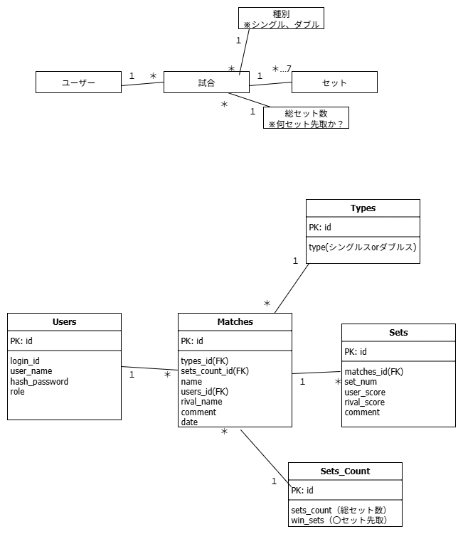

1. ## アプリの概要
- **タイトル**
     -  卓球の試合結果を、手軽にメモ！　～卓メモ！～
 - **一言紹介**
     - 自分の試合結果を、シンプルなUIで、手軽にメモできます。
- **ターゲットユーザー**
    - 卓球の試合に積極的に参加される方で、試合結果をメモしたい方。
    - WEB申し込み大会や部内リーグなど、同じ対戦相手と当たった際、過去の戦績を確認して戦術を組みたい方。
2. ## 設計図


3. ## APIエンドポイント一覧
### indexページ (/index) 
※ログイン前：thymeleafの属性、"sec：authorize="not authenticated""利用

| HTTPメソッド | パス | 説明 | リクエストボディ | レスポンス |
| :--- | :--- | :--- | :--- | :--- |
| **GET** | `/login` | ログイン画面を表示。 | - | `/login`のビュー |


### ログインページ (/login)

| HTTPメソッド | パス | 説明 | リクエストボディ | レスポンス |
| :--- | :--- | :--- | :--- | :--- |
| **POST** | `/login` | ユーザーのログイン認証を行う。 | `loginId=...`<br>`&password=...`| ログイン後、`/index`にリダイレクト。<br>失敗時は`/login?error`にリダイレクト。 |
| **GET** | `/register` | ユーザー登録画面を表示。 | - | `/register`のビュー |

### ユーザー登録ページ (/register)

| HTTPメソッド | パス | 説明 | リクエストボディ | レスポンス |
| :--- | :--- | :--- | :--- | :--- |
| **POST** | `/registerOut` | ユーザーの登録を行う。 | `loginId=...`<br>`&userName=...`<br>`&password=...`| 登録成功なら、`/registerOk`へリダイレクト。<br>失敗なら、`/register`のビュー |
| **GET** | `/login` | ログイン画面を表示。 | - | `/login`のビュー |

### ユーザー登録成功ページ (/registerOk)

| HTTPメソッド | パス | 説明 | リクエストボディ | レスポンス |
| :--- | :--- | :--- | :--- | :--- |
| **GET** | `/login` | ログイン画面を表示。 | - | `/login`のビュー |

### indexページ (/index) 
※ログイン後：thymeleafの属性、"sec：authorize="authenticated"を利用

| HTTPメソッド | パス | 説明 | リクエストボディ | レスポンス |
| :--- | :--- | :--- | :--- | :--- |
| **GET** | `/records` | 試合結果一覧画面を表示。 | - | `/records`のビュー |
| **GET** | `/userInformation` | ユーザー情報画面を表示。 | - | `/userInformation`のビュー |
| **POST** | `/logout` | ログアウトし、ログイン画面を表示。 | なし（SpringSecurityのCSRF対策のため、POSTを利用。） | `/login`のビュー |


### 試合結果一覧ページ (/records) 

| HTTPメソッド | パス | 説明 | リクエストボディ | レスポンス |
| :--- | :--- | :--- | :--- | :--- |
| **GET** | `/registerRecord1st` | 試合結果登録画面を表示。| - | `/registerRecord1st`のビュー |
| **GET** | `/index` | index画面を表示。| - | `/index`のビュー |
| **GET** | `/recordsProperties?matchId=...` | 試合の詳細画面を表示。クエリパラメータ `?matchId=...`でmatchIdを利用した検索を行う。| - | `/recordsProperties`のビュー |
| **GET** | `/editRecord1st?matchId=...` | 試合結果編集画面を表示。 | - | `/editRecord1st`のビュー |
| **GET** | `/deleteRecord?matchId=...` | 試合結果削除画面を表示。 |- | `/deleteRecord`のビュー |


### 試合結果登録ページ１ (/registerRecord1st) 

| HTTPメソッド | パス | 説明 | リクエストボディ | レスポンス |
| :--- | :--- | :--- | :--- | :--- |
| **GET** | `/records` | 試合結果一覧画面を表示。 | - | `/records`のビュー |
| **POST** | `/registerRecord1stOut` | 試合結果登録ページ２を表示。ページ１の入力内容をもとに、2ndでセット数の表示を動的に変更させる。 | `date=...`<br>`&matchName=...`<br>`&types=...`<br>`&setsCount=...`<br>`&pairName=...`<br>`&rivalName=...`<br>`&rivalName2=...`| 編集成功なら、`/registerRecord2nd`へリダイレクト。<br>失敗なら`/registerRecord1st`のビュー |

### 試合結果登録ページ２ (/registerRecord2nd)

| HTTPメソッド | パス | 説明 | リクエストボディ | レスポンス |
| :--- | :--- | :--- | :--- | :--- |
| **GET** | `/registerRecord1st` | 試合結果登録ページ１を表示。 | - | `/registerRecord1st`のビュー |
| **POST** | `/registerRecordOut` | 試合結果登録完了画面を表示。 |`sets[__${stat.index}__].myScore=...`<br>`&{sets[__${stat.index}__].rivalScore=...`<br>`&comment=...`<br>`&setsComment=...`<br>`&sets[__${stat.index}__].comment=...` | 登録成功なら、`/registerRecordOk`へリダイレクト。<br>失敗なら`/registerRecord2nd`のビュー。 |

### 試合結果登録完了ページ (/registerRecordOk)

| HTTPメソッド | パス | 説明 | リクエストボディ | レスポンス |
| :--- | :--- | :--- | :--- | :--- |
| **GET** | `/records` | 試合結果一覧画面を表示。 | - | `/records`のビュー |

### 試合結果詳細ページ (/recordProperties)
| HTTPメソッド | パス | 説明 | リクエストボディ | レスポンス |
| :--- | :--- | :--- | :--- | :--- |
| **GET** | `/records` | 試合結果一覧画面を表示。 | - | `/records`のビュー |

### 試合結果編集ページ１（/editRecord1st）

| HTTPメソッド | パス | 説明 | リクエストボディ | レスポンス |
| :--- | :--- | :--- | :--- | :--- |
| **GET** | `/records` | 試合結果一覧画面を表示。 | - | `/records`のビュー |
| **POST** | `/editRecord1stOut?matchId=...` | 試合結果編集ページ２を表示。ページ１の入力内容をもとに、2ndでセット数の表示を動的に変更させる。 | `date=...`<br>`&matchName=...`<br>`&types=...`<br>`&setsCount=...`<br>`&pairName=...`<br>`&rivalName=...`<br>`&rivalName2=...`  | 編集成功なら、`/editRecord2nd`へリダイレクト。<br>失敗なら`/editRecord1st`のビュー |


### 試合結果編集ページ２（/editRecord2nd）

| HTTPメソッド | パス | 説明 | リクエストボディ | レスポンス |
| :--- | :--- | :--- | :--- | :--- |
| **GET** | `/editRecord1st?matchId=...` | 試合結果編集ページ1を表示。 | - | `editRecord1st`のビュー |
| **POST** | `/editRecordOut?matchId=...` | 試合結果編集完了画面を表示。 | `sets[__${stat.index}__].myScore=...`<br>`&{sets[__${stat.index}__].rivalScore=...`<br>`&comment=...`<br>`&setsComment=...`<br>`&sets[__${stat.index}__].comment=...` | 編集成功なら、`/editRecordOk`へリダイレクト。<br>失敗なら`/editRecord2nd`のビュー。 |


### 試合結果編集完了ページ（/editRecordOk）

| HTTPメソッド | パス | 説明 | リクエストボディ | レスポンス |
| :--- | :--- | :--- | :--- | :--- |
| **GET** | `/records` | 試合結果一覧画面を表示。 | - | `/records`のビュー |

### 試合結果削除ページ（/deleteRecord）
| HTTPメソッド | パス | 説明 | リクエストボディ | レスポンス |
| :--- | :--- | :--- | :--- | :--- |
| **GET** | `/deleteRecordOut?matchId=...` | 試合結果削除画面を表示。 | - | `/deleteRecordOk`のビュー |
| **GET** | `/records` | 試合結果一覧を表示。 | - | `/records`のビュー |

### 試合結果削除完了ページ（/deleteRecordOk）
| HTTPメソッド | パス | 説明 | リクエストボディ | レスポンス |
| :--- | :--- | :--- | :--- | :--- |
| **GET** | `/records` | 試合結果一覧を表示。 | - | `/records`のビュー |

### ユーザー情報ページ（/userInformation）

| HTTPメソッド | パス | 説明 | リクエストボディ | レスポンス |
| :--- | :--- | :--- | :--- | :--- |
| **GET** | `/userEdit` | ユーザー編集画面を表示。 | - | `/userEdit`のビュー |
| **GET** | `/userDelete` | ユーザー削除画面を表示。 | - | `/userDelete`のビュー |
| **GET** | `/index` | index画面を表示。 | - | `/index`のビュー |

### ユーザー編集ページ（/userEdit）

| HTTPメソッド | パス | 説明 | リクエストボディ | レスポンス |
| :--- | :--- | :--- | :--- | :--- |
| **POST** | `/userEditOut` | ユーザー編集完了画面を表示。 |`loginId=...`<br>`&userName=...`<br>`&password=...` | 編集成功なら`/userEditOk`へリダイレクト。失敗なら `/userEdit`のビュー |
| **GET** | `/userInformation` | ユーザー情報画面を表示。 | - | `/userInformation`のビュー |
| **GET** | `/index` | index画面を表示。 | - | `/index`のビュー |

### ユーザー編集完了ページ（/userEditOk）

| HTTPメソッド | パス | 説明 | リクエストボディ | レスポンス |
| :--- | :--- | :--- | :--- | :--- |
| **GET** | `/index` | index画面を表示。 | - | `/index`のビュー |

### ユーザー削除ページ（/userDelete）
| HTTPメソッド | パス | 説明 | リクエストボディ | レスポンス |
| :--- | :--- | :--- | :--- | :--- |
| **GET** | `/userInformation` | ユーザー情報画面を表示。 | - | `/userInformation`のビュー |
| **GET** | `/userDeleteOut` | 削除完了画面を表示。 | - | `/userDeleteOk`のビュー |

### ユーザー削除完了ページ（/userDeleteOk）
| HTTPメソッド | パス | 説明 | リクエストボディ | レスポンス |
| :--- | :--- | :--- | :--- | :--- |
| **POST** | `/logout` | ログアウトし、ログイン画面を表示。 | なし（SpringSecurityのCSRF対策のため、POSTを利用。） | `/login`のビュー |


4. ## 使用技術
- **バックエンド**
    - 言語: Java 21
    - フレームワーク: Spring Boot 3.x
    - ビルドツール: Maven
    - データアクセス: Spring Data Jpa
    - 認証: Spring Security
- **データベース**
    - MySQL 8.0
- **フロントエンド**
    - 言語: HTML, CSS, JavaScript
- **インフラ**
    - 未定

5. ## アピールポイントと課題点
- **開発の動機、工夫した点:**
    - **アプリ作成の背景・動機**
        - 近年、ネットで申し込みができる卓球大会が急増し、自分の好きなタイミングで試合に参加できるようになった。
        - そのような中、手軽に試合結果がメモでき、かつ同じ対戦相手と当たった際、過去の戦績を確認して分析できるアプリのニーズが高まっていると感じた。
    - **開発中に特に力を入れた点**
        - **セット表示の動的な切り替え：**<br>卓球の試合は1～7セットマッチまであるため、試合に応じたセット数の表示を実現する必要があった。そこで、ユーザーが入力したセット数に応じ、バックエンド側でセットのインスタンス生成を行い、thymeleafのループ機能（th:each）を利用して表示することで、動的なセット数の表示を、可読性の高いコードで実現した。
        - **DBの構築：**<br>要件をもとにエンティティを洗い出し、ER図にまとめた上で、テーブル構築を行った。当初は、エンティティの洗い出し方が分からず、冗長なテーブル設計をしていたが、書籍の読解や業界の友人から話を聞くなどし、エンティティについて学ぶことで、複数テーブルへの切り出し、外部キーによる参照を実現する事が出来た。この経験から、開発におけるテーブル設計の重要性を学ぶことが出来た。
        - **セキュリティの構築：**<br>SpringSecurityのセッション管理・CSRFトークンの生成機能を利用したセッション固定攻撃・CSRFへの対策、SpringDataJpaのプリペアードステートメントを利用したSQLインジェクションへの対策、thymeleafのエスケープ処理を利用したXSSへの対策、パスワードエンコーダを利用したパスワードのハッシュ化による不正利用への対策を設定し、様々な脅威に対する堅牢なセキュリティを構築した。

- **今後の改善点:**
    - **追加したい機能**
        1. 対戦相手ごとの戦績の表示機能：<br>勝率、総獲得セット数、総獲得スコア数、セット毎の勝率、試合結果一覧など
        2. 分析機能：<br>スコア進行表や、得点時に使用した技術等の登録と、登録データを基にした分析機能（終盤に追いつかれる率が高い、バックハンドでの得点率が高いなど。） 試合を動画撮影するプレーヤーも多いため、分析のアシストができるようにしたい。

6. ## 開発環境とセットアップ方法
※このアプリケーションはDockerでコンテナ化されており、環境構築の手間を最小限に抑えられます。

- **動作確認環境**
    - **OS**: macOS, Windows, Linux （Dockerが動作する環境であれば、どのOSでも可）
    - **コンテナオーケストレーション**: Docker, Docker Compose
    - **Webサーバー**: Tomcat （Spring Bootに内蔵）
    - **バックエンド**:
        - 言語: Java 21
        - フレームワーク: Spring Boot 3.x
    - **データベース**:
        - MySQL 8.0 （Dockerコンテナとして動作）

- **セットアップ方法**
    1.  **DockerとDocker Composeのインストール**:
        お使いの環境にDocker Desktopをインストールしてください。
    2.  **リポジトリのクローン**:
        ```
        git clone [https://github.com/Kei-Sugiyama/TableTennisApplication](https://github.com/Kei-Sugiyama/TableTennisApplication.git)
        cd TableTennisApplication
        ```
    3.  **アプリケーションの起動**:
        プロジェクトのルートディレクトリで以下のコマンドを実行します。
        ```
        docker-compose up --build
        ```
    4.  **アプリケーションへのアクセス**:
        ブラウザで `http://localhost:8080` にアクセスしてください。